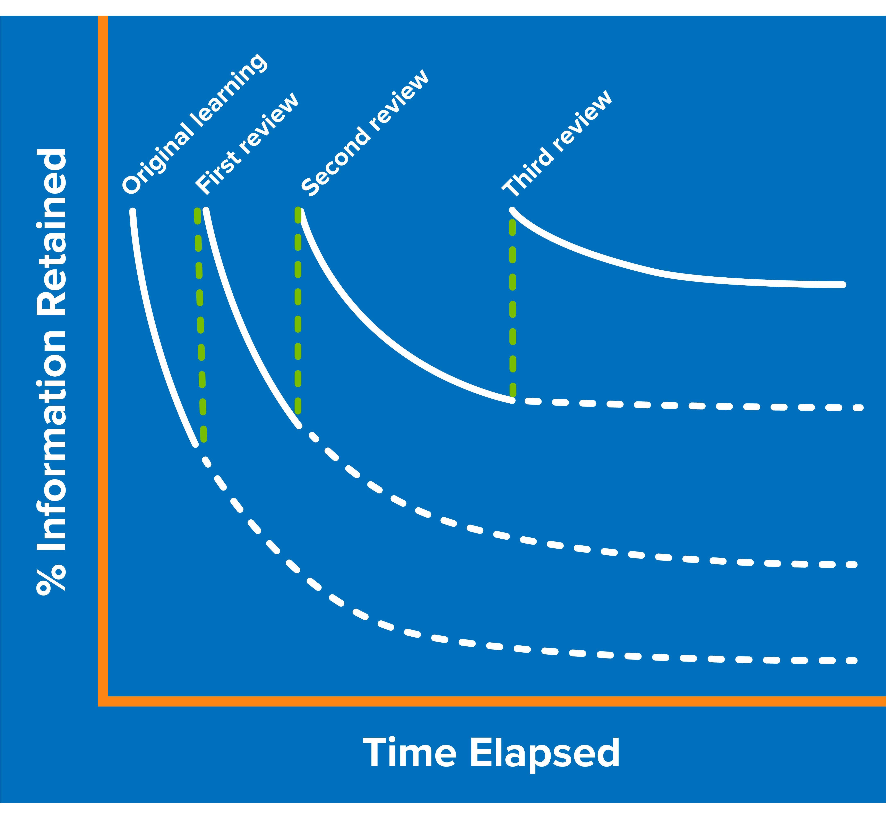

# Intelligent Notes Recall using Browser Extension

### What are the names and NetIDs of all your team members? Who is the captain? The captain will have more administrative duties than team members.
**Ashwin Nandkishor Patil [anpatil2@illinois.edu] [Team Lead]**

### What topic have you chosen? Why is it a problem? How does it relate to the theme and to the class?
Intelligent Notes Recall using Browser Extension, as time passes the percent of information retained from any notes or resource exponentially decreases, so as to combat the forgetting curve frequent recall / revision is utmost important. It uses three main topics taught during the class: **Language Models, Relevant Search and Relevance Feedback.**

### Briefly describe any datasets, algorithms or techniques you plan to use
+ Language Models for creating document embeddings for notes using word embeddings.
+ Relevant Search from list of notes related to the current article / paragraph.
+ Relevance Feedback from the related notes shown from the dynamic search while viewing a webpage.

### How will you demonstrate that your approach will work as expected?
Manual Testing + Automated Testing + User Testing

### Which programming language do you plan to use?
Python 3.10.x with Django and MongoDB for database

### Please justify that the workload of your topic is at least 20*N hours, N being the total number of students in your team. You may list the main tasks to be completed, and the estimated time cost for each task.
+ Architecture Design - 2 hours
+ API for Chrome / Firefox extension - 2 hours
+ Backend - 10 hours
+ Firefox / Chrome extension development - 6 hours
+ Testing - 2 hours
+ Documentation - 4 hours
+ Video Walkthrough - 2 hours
---
## Idea
The idea is to have an intelligent browser extension that reads the current browsing page dynamically and suggests the most related notes from your note-taking application databases. For instance, suppose you're reading an article on "Transformer Neural Networks" then the browser extension will dynamically read the webpage and show the most relevant notes to improve recall from the already saved notes.

## Motivation
I personally take a lot of notes, but the taking notes is not enough, we should be able to re-read the notes once in a while to improve memorization or understanding of the notes. Without which the importance of taking notes drastically decreases. 

This is the main problem that students face when the notes are not reviewed frequently and in an intuitive manner. The Information Retained decreases as the time elapses.

Fig.1 - The Forgetting Curve

To combat this phenomenon the main solution is to keep reviewing the notes frequently so that the % of information retained is maximized.

Fig.2 - Combating Forgetting Curve using Intelligent Recall

**This extension will help with information retention as well as intuitive note-taking.**

## Proposed Features
1. The browser extension will resurface related notes while browsing the internet.
2. Ability to take additional notes and save with ease.
3. Ability to give a search query in the browser extension itself for manually searching related notes.
4. Ability to give instant feedback on the search results using intuitive feedback mechanism.
5. Open the showcased note in the note-taking app it was taken from. 
6. Potentially, connecting multiple note-taking applications [Ambitious]
7. Login and Registration features.
8. Elegant UI

## References
[Combattign the Forgetting Curve](https://www.mindtools.com/pages/article/forgetting-curve.htm)